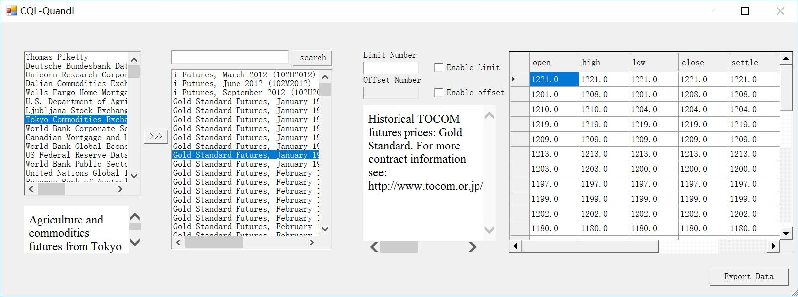

# CQL Excel

`CQL Excel`  is a Excel add-in for CovenantSQL.

## Why using this?

I'm a data ~~scientist~~ worker whose daliy job is collecting all kinds of data, analysising and charting it for PPT usage.

- Excel is an amazing tool, but not `csv`. It's really hard to share and maintain a `csv` based dataset.

- Database is an amazing old invention. It's easy to maintain and also SQL is powerful. But only few of my colleague can write SQL.

So, we use Excel with an PostgreSQL as backend. It works great! Then, I came across CovenantSQL which can be an Open Database Service. I realize that I can shared my dataset with all people need it. So, I wrote a dumb Excel add-in for it. I'm a C# newbee, the code is ugly, but it really works.

I have stored a mass macro economy & finance data in CovenantSQL. I will try my best keep the data up to data. May the data is useful to you.

## Using Excel to import data

The Excel add-in is based on the .Net Framework 4.5, as the result of that, this add-in only working on the Windows system. It should work on Office 2010 and above.



How to use CovenantSQL Excel Add-in to get massive economy & finance data?

1. Download Excel add-in from latest release:

    <https://github.com/melancholiaforever/CQL_Excel/releases>

2. Unzip the package to any path u like, for example `D:\covenantSQL` 

3. Using text editor such as notepad++ open the `CQLQuandl-Excel-en*.xll.config` (please check your Office version x86 or x64, the x86 version config is `CQLQuandl-Excel-en.xll`  x64 version is `CQLQuandl-Excel-en64.xll.config`). the modify the path of the`certpath` value  to the pfx file path like this: 

   ```<add key="certpath" value="D:\covenantSQL\read.data.covenantsql.io" />.```

4. Double clicking .xll file or load it in the menu of loading Excel Add-in.

5. There will be a "CovenantSQL Quandl" tab on the top.


## Data list

  

| **Database**     | **Name**                                                     | **Description**                                              | **Region**  | **Type**   |
| ---------------- | ------------------------------------------------------------ | ------------------------------------------------------------ | ----------- | ---------- |
| **PIKETTY**      | Thomas Piketty                                               | Data on Income and Wealth from "Capital in the 21st Century", Harvard University Press 2014. | Global      | macro      |
| **BUNDESBANK**   | Deutsche Bundesbank Data Repository                          | Data on the German economy, money and capital markets, public finances, banking, households, Euro-area aggregates, trade and external debt. | Germany     | macro      |
| **URC**          | Unicorn Research Corporation                                 | Advance and decline data for the NYSE, AMEX, and NASDAQ stock exchanges. From various publicly-available sources and the median value is reported. | US          | exchange   |
| **DCE**          | Dalian Commodities Exchange                                  | Agriculture and commodities futures from DCE, with history spanning almost a decade for select futures. | China       | exchange   |
| **WFC**          | Wells Fargo Home Mortgage Loans                              | This database offers mortgage purchase and refinance rates from Wells Fargo Home Mortgage, a division of Wells Fargo Bank. | US          | Finace     |
| **USDAFNS**      | U.S. Department of Agriculture FNS                           | Food and Nutrition Service administrates federal nutrition assistance programs for low-income households and children. Data on costs and participation rates. | US          | macro      |
| **LJUBSE**       | Ljubljana Stock Exchange (Slovenia)                          | This database contains the Ljubljana Stock Exchange indexes and is based in Ljubljana, Slovenia. | Slovenia    | exchange   |
| **TOCOM**        | Tokyo Commodities Exchange                                   | Agriculture and commodities futures from Tokyo Commodities Exchange (TOCOM), with history spanning almost a decade for select futures. | Japan       | exchange   |
| **WCSC**         | World Bank Corporate Scorecard                               | This database is designed to provide a strategic overview of the World Bank Group’s performance toward ending extreme poverty and promoting shared prosperity. | Global      | macro      |
| **CMHC**         | Canadian Mortgage and Housing Corporation                    | The CMHC is a gov’t-owned corporation that provides affordable housing to Canadian citizens and collects data such as prices, construction, and supply. | Canada      | Realty     |
| **WGEC**         | World Bank Global Economic Monitor (GEM) Commodities         | Data containing commodity prices and indices from 1960 to present. | Global      | macro      |
| **FED**          | US Federal Reserve Data Releases                             | Official US figures on money supply, interest rates, mortgages, government finances, bank assets and debt, exchange rates, industrial production. | US          | macro      |
| **WPSD**         | World Bank Public Sector Debt                                | Data jointly developed by the World Bank and the International Monetary Fund, which brings together detailed public sector government debt data. | Global      | macro      |
| **UGID**         | United Nations Global Indicators                             | This database offers a wide range of global indicators, covering population, public health, employment, trade, education, inflation and external debt. | Global      | macro      |
| **RBA**          | Reserve Bank of Australia                                    | Central bank and monetary authority, regulates banking industry, sets interest rates, and services government's debt. Data on key economic indicators. | Australia   | macro      |
| **UCOM**         | United Nations Commodity Trade                               | This database offers comprehensive global data on imports and exports of commodities such as food, live animals, pharmaceuticals, metals, fuels and machinery. | Global      | macro      |
| **SIDC**         | Solar Influences Data Analysis Center                        | The SIDC hosts data spanning from the 1700's on solar activity, specifically sunspot activity. | Global      | astronomer |
| **ZCE**          | Zhengzhou Commodities Exchange                               | Agriculture and commodities futures from ZCE, with history spanning almost a decade for select futures. | China       | exchange   |
| **USDAFAS**      | U.S. Department of Agriculture FAS                           | The USDA Foreign Agricultural Service connects U.S. agriculture with the world markets. It provides statistics on production and exports in foreign countries. | US          | macro      |
| **OECD**         | Organisation for Economic Co-operation and Development       | International organization of developed countries that promotes economic welfare. Collects data from members and others to make policy recommendations. | Global      | macro      |
| **OPEC**         | Organization of the Petroleum Exporting Countries            | International organization and economic cartel overseeing policies of oil-producers, such as Iraq, Iran, Saudi Arabia, and Venezuela. Data on oil prices. | Global      | energy     |
| **MCX**          | Multi Commodity Exchange India                               | India's largest commodity exchange servicing futures trading in metals, energy, and agriculture. World's 3rd largest exchange in contracts and trading volume. | India       | exchange   |
| **ECONOMIST**    | The Economist - Big Mac Index                                | The Big Mac index was invented by The Economist in 1986 as a lighthearted guide to whether currencies are at their “correct” level. It is based on the theory of purchasing-power parity (PPP). | Global      | macro      |
| **NSDL**         | National Securities Depository Limited (India)               | Depository in India responsible for economic development of the country that has established a national infrastructure of international standards that handles most of the securities held and settled in dematerialised form in the Indian capital market. | India       | exchange   |
| **GDT**          | Global Dairy Trade                                           | nan                                                          | Global      | macro      |
| **CFFEX**        | China Financial Futures Exchange                             | Index and bond futures from CFFEX, with history spanning almost a decade for select futures. | China       | exchange   |
| **CITYPOP**      | Thomas Brinkhoff: City Populations                           | Thomas Brinkhoff provides population data for cities and administrative areas in most countries. | Global      | macro      |
| **BCHARTS**      | Bitcoin Charts Exchange Rate Data                            | Exchange rates for bitcoin against a large number of currencies, from all major bitcoin exchanges, including current and historical exchange rates. | Global      | exchange   |
| **LOCALBTC**     | Local Bitcoins                                               | nan                                                          | Global      | exchange   |
| **JODI**         | JODI Oil World Database                                      | JODI oil and gas data comes from over 100 countries consisting of multiple energy products and flows in various methods of measurement. | Global      | energy     |
| **UENG**         | United Nations Energy Statistics                             | This database offers comprehensive global statistics on production, trade, conversion, and final consumption of new and renewable energy sources. | Global      | macro      |
| **ULMI**         | United Nations Labour Market Indicators                      | This database offers comprehensive youth unemployment figures broken up by gender for all countries in the world. | Global      | macro      |
| **MAURITIUSSE**  | Stock Exchange of Mauritius                                  | Stock Exchange of Mauritius indices data.                    | Mauritius   | exchange   |
| **UKRSE**        | Ukrainian Exchange                                           | UKRSE presents the most current available data related to the largest stock exchanges in Ukraine. The exchange is located in Kiev and accounts for roughly three-quarters of Ukraine's total equity trading volume | Ukraine     | exchange   |
| **BITSTAMP**     | Bitstamp                                                     | Bitstamp is a trading platform for Bitcoin.                  | Global      | exchange   |
| **UNAE**         | United Nations National Accounts Estimates                   | This database offers global data on gross domestic product, gross national income, and gross value added by different sectors for all countries in the world. | Global      | macro      |
| **UNAC**         | United Nations National Accounts Official Country Data       | This database offers global data on national accounts, such as assets and liabilities of households, corporations and governments. | Global      | macro      |
| **UTOR**         | United Nations World Tourism                                 | This database offers comprehensive data on international tourism. Data includes number of tourist arrivals and tourism expenditures for all countries. | Global      | macro      |
| **WFE**          | World Federation of Exchanges                                | A trade association of sixty publicly regulated stock, futures, and options exchanges that publishes data for its exchanges, like market capitalization. | Global      | exchange   |
| **FRBC**         | Federal Reserve Bank of Cleveland                            | The Federal Reserve Bank of Cleveland collects data from hundreds of financial institutions, including depository institutions, bank holding companies, and other entities that is used to assess financial institution conditions and also to glean insights into how the economy and financial system are doing. | US          | macro      |
| **UGEN**         | United Nations Gender Information                            | This database offers comprehensive global data on a wide range of gender-related indicators, covering demography, health, education and employment. | Global      | macro      |
| **BITFINEX**     | Bitfinex                                                     | Bitfinex is a trading platform for Bitcoin, Litecoin and Darkcoin with many advanced features including margin trading, exchange and peer to peer margin funding. | Global      | macro      |
| **UGHG**         | United Nations Greenhouse Gas Inventory                      | This database offers comprehensive global data on anthropogenic emissions of the six principal greenhouse gases. Data goes back to 1990. | Global      | macro      |
| **UIST**         | United Nations Industrial Development Organization           | This database offers global data on industrial development indicators, including output, employees, wages, value added for a wide range of industries. | Global      | macro      |
| **PRAGUESE**     | Prague Stock Exchange                                        | Price index data from the Prague Stock Exchange.             | Czech       | exchange   |
| **PFTS**         | PFTS Stock Exchange (Ukraine)                                | Index data from the PFTS Stock Exchange, the largest marketplace in Ukraine. | Ukraine     | exchange   |
| **WARSAWSE**     | Warsaw Stock Exchange                                        | WIG20 index has been calculated since April 16, 1994 based on the value of portfolio with shares in 20 major and most liquid companies in the WSE Main List. | Poland      | exchange   |
| **TUNISSE**      | Tunis Stock Exchange                                         | The main reference index of Tunis Stock Exchange.            | Tunisia     | exchange   |
| **FRKC**         | Federal Reserve Bank of Kansas City                          | FRKC is the regional central bank for the 10th District of the Federal Reserve, publishing data on banking in mostly agricultural transactions. | US          | Banking    |
| **UENV**         | United Nations Environment Statistics                        | This database offers global data on water and waste related indicators, including fresh water supply and precipitation, and generation and collection of waste. | Global      | macro      |
| **UFAO**         | United Nations Food and Agriculture                          | This database offers global food and agricultural data, covering crop production, fertilizer consumption, use of land for agriculture, and livestock. | Global      | macro      |
| **TAIFEX**       | Taiwan Futures Exchange                                      | Index and bond futures from TAIFEX, with history spanning over a decade for select futures. | China       | exchange   |
| **GDAX**         | GDAX (Global Digital Asset Exchange)                         | GDAX is the world’s most popular place to buy and sell bitcoin. | Global      | exchange   |
| **ARES**         | Association for Real Estate Securitization                   | ARES protects investors, contributes to development of the real estate securitization product market, and facilitates expansion of the real estate investment market. | Japan       | Realty     |
| **SHADOWS**      | Wu-Xia Shadow Federal Funds Rate                             | This dataset contains the three major indicators from the Wu-Xia papers which serve to identify the shadow rates on all three major banks. | Global      | macro      |
| **NAAIM**        | NAAIM Exposure Index                                         | The NAAIM Exposure Index represents the average exposure to US Equity markets reported by NAAIM members. | US          | Finace     |
| **CBRT**         | Central Bank of the Republic of Turkey                       | CBRT is responsible for taking measures to sustain the stability of the financial system in Turkey. | Turkey      | macro      |
| **CEGH**         | Central European Gas Hub                                     | No description for this database yet.                        | Euro        | energy     |
| **FINRA**        | Financial Industry Regulatory Authority                      | Financial Industry Regulatory Authority provides short interest data on securities firms and exchange markets. | US          | Finace     |
| **NASDAQOMX**    | NASDAQ OMX Global Index Data                                 | Over 35,000 global indexes published by NASDAQ OMX including Global Equity, Fixed Income, Dividend, Green, Nordic, Sharia and more.  Daily data. | Global      | Finace     |
| **EURONEXT**     | Euronext Stock Exchange                                      | Historical stock data from Euronext, the largest European exchange. | Euro        | exchange   |
| **UICT**         | United Nations Information and Communication Technology      | This database offers comprehensive global data on information and communication technology, including telephone, cellular and internet usage for all countries. | Global      | telecom    |
| **USAID**        | U.S. Agency for International Development                    | US Agency for International Development provides a complete historical record of all foreign assistance provided by the United States to the rest of the world. | US          | macro      |
| **ZAGREBSE**     | Zagreb Stock Exchange                                        | Croatia's only stock exchange. It publishes data on the performance of its stock and bond indexes. | Croatia     | exchange   |
| **QUITOSE**      | Quito Stock Exchange (Ecuador)                               | The indexes of the national Stock Exchange of Ecuador.       | Ecuador     | exchange   |
| **ECBCS**        | European Commission Business and Consumer Surveys            | Data in this database is derived from harmonized surveys for different sectors of the economies in the European Union (EU) and in the EU applicant countries. | Euro        | macro      |
| **PSE**          | Paris School of Economics                                    | This database describes the distribution of top incomes in a growing number of countries. Numbers are derived using tax data. | Global      | macro      |
| **MALTASE**      | Malta Stock Exchange                                         | The Malta Stock Exchange carries out the role of providing a structure for admission of financial instruments to its recognised lists which may subsequently be traded on a regulated, transparent and orderly market place (secondary market).The main participants in the market are Issuers, Stock Exchange Members (stockbrokers), and the investors in general. | Malta       | exchange   |
| **GPP**          | Global Petroleum Prices                                      | No description for this database yet.                        | Global      | energy     |
| **PPE**          | Polish Power Exchange (TGE)                                  | No description for this database yet.                        | Poland      | energy     |
| **UKONS**        | United Kingdom Office of National Statistics                 | Data on employment, investment, housing, household expenditure, national accounts, and many other socioeconomic indicators in the United Kingdom. | UK          | macro      |
| **NCDEX**        | National Commodity & Derivatives Exchange Limited (India)    | A professionally managed on-line multi-commodity exchange in India | India       | exchange   |
| **WSE**          | Warsaw Stock Exchange (GPW)                                  | No description for this database yet.                        | Poland      | exchange   |
| **TFX**          | Tokyo Financial Exchange                                     | The Tokyo Financial Exchange is a futures exchange that primary deals in financial instruments markets that handle securities and market derivatives. | Japan       | exchange   |
| **WGFD**         | World Bank Global Financial Development                      | Data on financial system characteristics, including measures of size, use, access to, efficiency, and stability of financial institutions and markets. | Global      | macro      |
| **CEPEA**        | Center for Applied Studies on Applied Economics (Brazil)     | CEPEA is an economic research center at the University of Sao Paulo focusing on agribusiness issues, publishing price indices for commodities in Brazil. | Brazil      | macro      |
| **SBJ**          | Statistics Bureau of Japan                                   | A Japanese government statistical agency that provides statistics related to employment and the labour force. | Japan       | macro      |
| **WGEM**         | World Bank Global Economic Monitor                           | Data on global economic developments, with coverage of high-income, as well as developing countries. | Global      | macro      |
| **WGDF**         | World Bank Global Development Finance                        | Data on financial system characteristics, including measures of size, use, access to, efficiency, and stability of financial institutions and markets. | Global      | macro      |
| **WWDI**         | World Bank World Development Indicators                      | Most current and accurate development indicators, compiled from officially-recognized international sources. | Global      | macro      |
| **WESV**         | World Bank Enterprise Surveys                                | Company-level private sector data, covering business topics including finance, corruption, infrastructure, crime, competition, and performance measures. | Global      | macro      |
| **WDBU**         | World Bank Doing Business                                    | Data on business regulations and their enforcement for member countries and selected cities at the subnational and regional level. | Global      | macro      |
| **OSE**          | Osaka Securities Exchange                                    | The second largest securities exchange in Japan. Unlike the TSE, OSE is strongest in derivatives trading, the majority of futures and options in Japan. | Japan       | exchange   |
| **RFSS**         | Russian Federation Statistics Service                        | The Russian governmental statistical agency that publishes social, economic, and demographic statistics for Russia at the national and local levels. | Russia      | macro      |
| **SHFE**         | Shanghai Futures Exchange                                    | Commodities exchange for energy, metal, and chemical-related industrial products. A derivatives marketplace for many commodities futures. | China       | exchange   |
| **WGEP**         | World Bank GEP Economic Prospects                            | Data on the short-, medium, and long-term outlook for the global economy and the implications for developing countries and poverty reduction. | Global      | macro      |
| **USMISERY**     | United States Misery Index                                   | Developed by economist Arthur Okun, the Misery Index is the unemployment rate added to the inflation rate. | US          | macro      |
| **WJKP**         | World Bank Jobs for Knowledge Platform                       | Indicators on labor-related topics.                          | Global      | macro      |
| **WMDG**         | World Bank Millennium Development Goals                      | Data drawn from the World Development Indicators, reorganized according to the goals and targets of the Millennium Development Goals (MDGs). | Global      | macro      |
| **WPOV**         | World Bank Poverty Statistics                                | Indicators on poverty headcount ratio, poverty gap, and number of poor at both international and national poverty lines. | Global      | macro      |
| **EUREKA**       | Eurekahedge                                                  | A research company focused on hedge funds and other alternative investment funds. It publishes data on the performances of hedge funds. | Global      | Finace     |
| **MOFJ**         | Ministry of Finance Japan                                    | Japanese government bond interest rate data, published daily by the Ministry of Finance. | Japan       | macro      |
| **PSX**          | Pakistan Stock Exchange                                      | Daily closing stock prices from the Pakistan Stock Exchange. | Pakistan    | exchange   |
| **SGX**          | Singapore Exchange                                           | Asian securities and derivatives exchange that trades in equities for many large Singaporean and other Asian companies. Listed on its own exchange. | Singapore   | exchange   |
| **UIFS**         | United Nations International Financial Statistics            | This database offers comprehensive data on international financial indicators, such as average earnings, bond yields, government revenues and expenditures. | Global      | macro      |
| **UINC**         | United Nations Industrial Commodities                        | This database offers global data on production of industrial commodities, such as ores and minerals, food products, transportable goods, and metal products. | Global      | macro      |
| **INSEE**        | National Institute of Statistics and Economic Studies (France) | INSEE is the national statistical agency of France. It collects data on France's economy and society, such as socioeconomic indicators and national accounts. | France      | macro      |
| **SNB**          | Swiss National Bank                                          | Central bank responsible for monetary policy and currency. Data on international accounts, interest rates, money supply, and other macroeconomic indicators. | Switzerland | macro      |
| **ODE**          | Osaka Dojima Commodity Exchange                              | A non-profit commodity exchange in the Kansai region of Japan that trades in seven key agricultural commodities. | Japan       | exchange   |
| **WGEN**         | World Bank Gender Statistics                                 | Data describing gender differences in earnings, types of jobs, sectors of work, farmer productivity, and entrepreneurs’ firm sizes and profits. | Global      | macro      |
| **WHNP**         | World Bank Health Nutrition and Population Statistics        | Key health, nutrition and population statistics.             | Global      | macro      |
| **WIDA**         | World Bank International Development Association             | Data on progress on aggregate outcomes for IDA (International Development Association) countries for selected indicators. | Global      | macro      |
| **ECMCI**        | European Commission Monetary Conditions Index                | Updated monthly, this database provides monetary conditions index values in the Euro zone. History goes back to 1999. | Euro        | macro      |
| **NBSC**         | National Bureau of Statistics of China                       | Statistics of China relating to finance, industry, trade, agriculture, real estate, and transportation. | China       | macro      |
| **MAS**          | Monetary Authority of Singapore                              | No description for this database yet.                        | Singapore   | macro      |
| **MGEX**         | Minneapolis Grain Exchange                                   | A marketplace of futures and options contracts for regional commodities that facilitates trade of agricultural indexes. | US          | exchange   |
| **WWGI**         | World Bank Worldwide Governance Indicators                   | Data on aggregate and individual governance indicators for six dimensions of governance. | Global      | macro      |
| **ISM**          | Institute for Supply Management                              | ISM promotes supply-chain management practices and publishes data on production and supply chains, new orders, inventories, and capital expenditures. | US          | macro      |
| **UKR**          | Ukrainian Exchange                                           | No description for this database yet.                        | Ukraine     | exchange   |
| **FRBNY**        | Federal Reserve Bank of New York                             | The FRBNY is the largest regional central bank in the US. Sets monetary policy for New York, most of Connecticut and New Jersey, and some territories. | US          | macro      |
| **FRBP**         | Federal Reserve Bank of Philadelphia                         | The FRBP is a regional central bank for the Federal Reserve. It publishes data on business confidence indexes, GDP, consumption, and other economic indicators. | US          | macro      |
| **FMSTREAS**     | US Treasury - Financial Management Service                   | The monthly receipts/outlays and deficit/surplus of the United States of America. | US          | macro      |
| **EIA**          | U.S. Energy Information Administration Data                  | US national and state data on production, consumption and other indicators on all major energy products, such as electricity, coal, natural gas and petroleum. | US          | macro      |
| **SOCSEC**       | Social Security Administration                               | Provides data on the US social security program, particularly demographics of beneficiaries; disabled, elderly, and survivors. | US          | macro      |
| **TFGRAIN**      | Top Flight Grain Co-operative                                | Cash price of corn and soybeans including basis to front month futures contract. | US          | Finace     |
| **IRPR**         | Puerto Rico Institute of Statistics                          | Puerto Rico Institute of Statistics statistics on manufacturing. | US          | macro      |
| **BCHAIN**       | Blockchain                                                   | Blockchain is a website that publishes data related to Bitcoin, updated daily. | Global      | Finace     |
| **BITCOINWATCH** | Bitcoin Watch                                                | Bitcoin mining statistics.                                   | Global      | Finace     |
| **ODA**          | IMF Cross Country Macroeconomic Statistics                   | IMF primary commodity prices and world economic outlook data, published by Open Data for Africa. Excellent cross-country macroeconomic data. | Global      | macro      |
| **WADI**         | World Bank Africa Development Indicators                     | A collection of development indicators on Africa, including national, regional and global estimates. | Global      | macro      |
| **WEDU**         | World Bank Education Statistics                              | Internationally comparable indicators on education access, progression, completion, literacy, teachers, population, and expenditures. | Global      | macro      |
| **WGLF**         | World Bank Global Findex (Global Financial Inclusion database) | Indicators of financial inclusion measures on how people save, borrow, make payments and manage risk. | Global      | macro      |
| **WWID**         | World Wealth and Income Database                             | The World Wealth and Income Database aims to provide open and convenient access to the most extensive available database on the historical evolution of the world distribution of income and wealth, both within countries and between countries. | Global      | macro      |
| **BTER**         | BTER                                                         | Historical exchange rate data for crypto currencies.         | Global      | exchange   |
| **CFTC**         | Commodity Futures Trading Commission Reports                 | Weekly Commitment of Traders and Concentration Ratios. Reports for futures positions, as well as futures plus options positions. New and legacy formats. | Global      | Finace     |
| **BOE**          | Bank of England Official Statistics                          | Current and historical exchange rates, interest rates on secured loans and time deposits, Euro-commercial paper rates, and yields on government securities. | UK          | macro      |
| **EXMPL**        | Quandl Example Time-Series Data                              | An example time series database.                             | Sample      | Sample     |
| **WORLDAL**      | Aluminium Prices                                             | World Aluminium capacity and production in thousand metric tonnes. | Global      | Finace     |
| **WGC**          | Gold Prices                                                  | The World Gold Council is a market development organization for the gold industry. It publishes data on gold prices in different currencies. | Global      | Finace     |
| **MX**           | Canadian Futures                                             | Montreal Exchange is a derivatives exchange that trades in futures contracts and options for equities, indices, currencies, ETFs, energy, and interest rates. | China       | exchange   |
| **UMICH**        | Consumer Sentiment                                           | The University of Michigan’s consumer survey - data points for the most recent 6 months are unofficial; they are sourced from articles in the Wall Street Journal. | Global      | Finace     |
| **JOHNMATT**     | Rare Metals                                                  | Current and historical data on platinum group metals such as prices, supply, and demand. | Global      | Finace     |
| **NAHB**         | US Housing Indices                                           | Housing and economic indices for the United States.          | US          | Realty     |
| **RATEINF**      | Inflation Rates                                              | Inflation Rates and the Consumer Price Index CPI for Argentina, Australia, Canada, Germany, Euro area, France, Italy, Japan, New Zealand and more. | Global      | macro      |
| **RENCAP**       | IPOs                                                         | Data on the IPO market in the United States.                 | US          | Finace     |
| **ML**           | Corporate Bond Yield Rates                                   | Merrill Lynch, a major U.S. bank, publishes data on yield rates for corporate bonds in different regions. | US          | Finace     |
| **MULTPL**       | S&P 500 Ratios                                               | No description for this database yet.                        | US          | Finace     |
| **RICI**         | Commodity Indices                                            | Composite, USD based, total return index, representing the value of a basket of commodities consumed in the global economy. | Global      | macro      |
| **AAII**         | Investor Sentiment                                           | American Association of Individual Investor’s sentiment data. | US          | macro      |
| **BIS**          | Bank for International Settlements                           | BIS serves central banks with administration of monetary and financial stability, fosters international cooperation, and acts as bank for central banks. | Global      | macro      |
| **BCB**          | Central Bank of Brazil Statistical Database                  | Brazilian macroeconomic data, covering public finances, national accounts, payment systems, inflation, exchange rates, trade, and international reserves. | Brazil      | macro      |
| **BCRA**         | Central Bank of Argentina                                    | The Central Bank of Argentina is responsible monetary policy and provides data on foreign exchange markets and key macroeconomic indicators. | Argentina   | macro      |
| **FSE**          | Frankfurt Stock Exchange                                     | Daily stock prices from the Frankfurt Stock Exchange         | Germany     | exchange   |
| **BLSN**         | BLS International                                            | Import and export price statistics for various countries, published by the Bureau of Labor Statistics. | Global      | macro      |
| **BLSP**         | BLS Productivity                                             | US manufacturing, labor and business statistics, published by the Bureau of Labor Statistics. | US          | macro      |
| **FDIC**         | Federal Deposit Insurance Corporation                        | The FDIC is a federal insurer of bank deposits up to $250k and collects finance data on commercial banking and savings institutions. | US          | macro      |
| **BLSI**         | BLS Inflation & Prices                                       | US national and state-level inflation data, published by the Bureau of Labor Statistics. | US          | macro      |
| **BLSE**         | BLS Employment & Unemployment                                | US national and state-level employment and unemployment statistics, published by the Bureau of Labor Statistics. | US          | macro      |
| **BLSB**         | BLS Pay & Benefits                                           | US work stoppage statistics, published by the Bureau of Labor Statistics. | US          | macro      |
| **BP**           | Energy Production and Consumption                            | BP is a large energy producer and distributor. It provides data on energy production and consumption in individual countries and larger subregions. | Global      | energy     |
| **LPPM**         | Platinum & Palladium Prices                                  | Price data on the market-clearing level for Palladium and Platinum around the world. | Global      | Finace     |
| **CASS**         | Freight Indices                                              | Since 1990, CASS provides monthly Cass Freight Index Reports on freight trends as they relate to other economic and supply chain indicators. | Global      | macro      |
| **MORTGAGEX**    | ARM Indices                                                  | Historical housing data on ARM indexes.                      | US          | Realty     |
| **BUCHARESTSE**  | Bucharest Stock Exchange                                     | The Bucharest Stock Exchange publishes data on it activity in equity, rights, bonds, fund units, structured products, and futures contracts. | Romania     | exchange   |
| **AMECO**        | European Commission Annual Macro-Economic Database           | Annual macro-economic database of the European Commission's Directorate General for Economic and Financial Affairs (DG ECFIN). | Euro        | macro      |
| **ACC**          | American Chemistry Council                                   | Chemical Activity Barometer (CAB) published by the American Chemistry Council (ACC). The CAB is an economic indicator that helps anticipate peaks and troughs in the overall US economy and highlights potential trends in other industries in the US. | US          | macro      |
| **ABMI**         | Asia Bond Market Initiative                                  | Indicators of Chinese and Japanese bond markets, such as size and composition, market liquidity, yield returns, and volatility. | Asia        | Finace     |
| **BITAL**        | Borsa Italiana                                               | This database provides data on stock future contracts from the Borsa Italiana, now part of London Stock Exchange Group. | Italy       | exchange   |
| **BANKRUSSIA**   | Bank of Russia                                               | Primary indicators from the Bank of Russia, including data on the banking sector, money supply, financial markets and macroeconomic statistical data. | Russia      | macro      |
| **BOC**          | Bank of Canada Statistical Database                          | Economic, financial and banking data for Canada. Includes interest rates, inflation, national accounts and more.  Daily updates. | China       | macro      |
| **HKEX**         | Hong Kong Exchange                                           | Hong Kong Exchange stock prices, historical divided futures, etc. updated daily. | China       | macro      |
| **AMFI**         | Association of Mutual Funds in India                         | This database represents fund information from The Association of Mutual Funds in India. | India       | Finace     |
| **BDM**          | Bank of Mexico                                               | The Bank of Mexico is responsible for monetary policy and the national currency (peso), and provides data on accounts and all macroeconomic variables. | Mexico      | macro      |
| **BATS**         | BATS U.S. Stock Exchanges                                    | Bats is an equities market operator in the U.S., operating four equities exchanges — BZX Exchange, BYX Exchange, EDGA Exchange, and EDGX Exchange | US          | exchange   |
| **BSE**          | Bombay Stock Exchange                                        | End of day prices, indices, and additional information for companies trading on the Bombay Stock Exchange in India. | India       | exchange   |
| **FRED**         | Federal Reserve Economic Data                                | Growth, employment, inflation, labor, manufacturing and other US economic statistics from the research department of the Federal Reserve Bank of St. Louis. | US          | macro      |
| **FMAC**         | Freddie Mac                                                  | Data from Freddie Mac’s Primary Mortgage Market Survey and other region specific historical mortgage rates. | US          | Finace     |
| **EUREX**        | EUREX Futures Data                                           | Index, rate, agriculture and energy futures from EUREX, Europe's largest futures exchange, with history spanning a decade for select futures. | Euro        | exchange   |
| **ECB**          | European Central Bank                                        | The central bank for the European Union oversees monetary policy and the Euro, and provides data on related macroeconomic variables. | Euro        | macro      |
| **BOF**          | Bank of France                                               | The Banque de France is responsible for monetary policy through policies of the European System of Central Banks and providing data on key economic indictors. | France      | macro      |
| **BELGRADESE**   | Belgrade Stock Exchange                                      | Belgrade Stock Exchange data, updated daily.                 | Serbia      | exchange   |
| **CHRIS**        | Wiki Continuous Futures                                      | Continuous contracts for all 600 futures on Quandl. Built on top of raw data from CME, ICE, LIFFE etc. Curated by the Quandl community. 50 years history. | Global      | exchange   |
| **BOJ**          | Bank of Japan                                                | nan                                                          | Japan       | macro      |
| **USTREASURY**   | US Treasury                                                  | The U.S. Treasury ensures the nation's financial security, manages the nation's debt, collects tax revenues, and issues currency, provides data on yield rates. | US          | macro      |
| **LBMA**         | London Bullion Market Association                            | An international trade association in the London gold and silver market, consisting of central banks, private investors, producers, refiners, and other agents. | UK          | macro      |
| **PERTH**        | Perth Mint                                                   | The Perth Mint’s highs, lows and averages of interest rates and commodities prices, updated on a monthly basis. | Global      | Finace     |
| **ZILLOW2**      | Zillow Real Estate Research                                  | Home prices and rents by size, type and tier; housing supply, demand and sales. Sliced by zip code, neighbourhood, city, metro area, county and state. | US          | Realty     |

